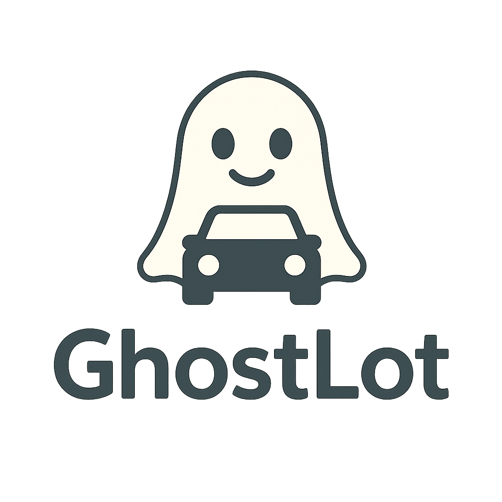

# GhostLot by Refraction - Dealership SaaS App



## Overview

GhostLot is a comprehensive SaaS platform for auto dealerships that revolutionizes the car buying and selling experience. This application enables dealerships to manage their inventory, generate QR codes for vehicles, track test drive requests, manage reservations, and analyze customer interactions with their inventory.

## Key Features

### For Dealerships

- **QR Code Generation**: Generate and print QR codes for vehicles in inventory
- **Inventory Management**: Add, edit, and track vehicles with status updates (Active, Reserved, Sold)
- **Customizable Profile**: Personalize the dealership's branding and business information
- **Test Drive Request Management**: Track and respond to customer test drive requests
- **Vehicle Reservation System**: Process vehicle reservations with status tracking
- **Analytics Dashboard**: Visualize performance metrics including QR scans, test drives, and more
- **Integrated Settings**: Connect with DMS providers and manage notifications

### For Consumers

- **Mobile-Optimized Vehicle View**: Scan QR codes to access comprehensive vehicle information
- **Vehicle Specs & Reviews**: View detailed specifications and expert reviews
- **Interactive Payment Calculator**: Calculate monthly payments with customizable terms
- **Trade-In Estimator**: Get estimated trade-in values
- **Test Drive Scheduling**: Schedule test drives directly through the app
- **Vehicle Reservation**: Reserve vehicles with secure deposits
- **User Profiles**: Save favorite vehicles and track appointments

## Demo

This is a demo version of the GhostLot platform that showcases the core functionality. It includes:

1. A toggle feature to switch between dealer and consumer views
2. Sample data for demonstration purposes
3. Interactive UI components that simulate the full application experience

## Technical Details

- Built with React (18.x)
- Styled with Tailwind CSS
- Uses Lucide React for icons
- Mobile-responsive design
- Implements modern React patterns including hooks and context

## Getting Started

### Prerequisites

- Node.js (v14 or higher)
- npm (v6 or higher)

### Installation

1. Clone the repository:
   ```bash
   git clone https://github.com/yourusername/ghostlot-demo.git
   cd ghostlot-demo
   ```

2. Install dependencies:
   ```bash
   npm install
   ```

3. Set up environment variables:
   Create a `.env.local` file in the root directory with the following content:
   ```
   # Supabase Environment Variables
   # For development, you'll need to replace these with your actual Supabase credentials
   # or use placeholder values for development without a Supabase instance
   NEXT_PUBLIC_SUPABASE_URL=https://your-supabase-project.supabase.co
   NEXT_PUBLIC_SUPABASE_ANON_KEY=your-anon-key-from-supabase-settings
   ```

4. Start the development server:
   ```bash
   npm run dev
   ```

5. Open [http://localhost:3000](http://localhost:3000) to view it in your browser.

## Supabase Configuration

This application uses Supabase for backend services including authentication and database. For development and testing:

1. Create a free account at [Supabase](https://supabase.com)
2. Create a new project
3. Copy your project URL (Settings > API > Project URL) and anon key (Settings > API > Project API keys) to the `.env.local` file
4. To set up the required tables and schema, see the [database setup guide](database-setup.md)

Note: For development without a Supabase instance, you can use mock values in the environment variables, but many features will not work correctly.

## Deployment

For deployment instructions, please see [DEPLOYMENT.md](DEPLOYMENT.md).

## Project Structure

```
ghostlot-demo/
├── public/
│   ├── index.html
│   ├── favicon.ico
│   └── ghostlot-logo.png
├── src/
│   ├── components/
│   │   ├── ConsumerVehicleView.jsx
│   │   ├── DealerDashboard.jsx
│   │   ├── InventoryManagement.jsx
│   │   ├── LoginScreen.jsx
│   │   ├── QRCodeGenerator.jsx
│   │   ├── ReservationManagement.jsx
│   │   ├── TestDriveRequests.jsx
│   │   └── UserProfile.jsx
│   ├── App.jsx
│   ├── index.jsx
│   └── index.css
├── .gitignore
├── package.json
├── README.md
├── DEPLOYMENT.md
└── tailwind.config.js
```

## License

This demo is provided for demonstration purposes only.

## Contact

For more information about Refraction and GhostLot, contact:

- Website: [www.refraction.dev](https://www.refraction.dev)
- Email: info@refraction.dev

---

*Note: This is a demo application and not intended for production use without further development and security enhancements.*
